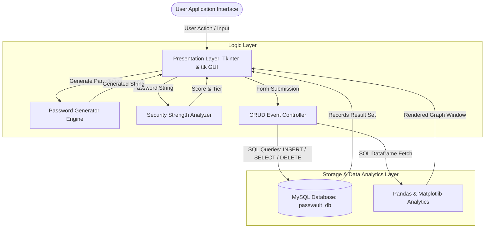
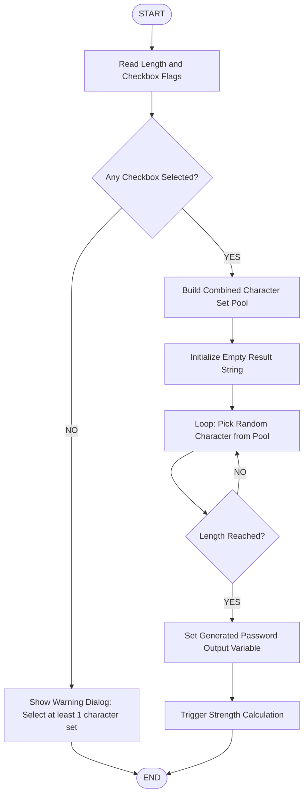
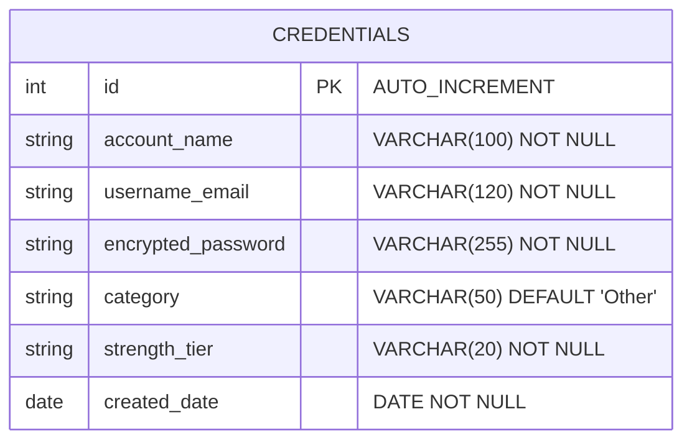

# PASSVAULT: SENIOR SCHOOL COMPUTER SCIENCE PROJECT REPORT

**PROJECT TITLE:** PassVault — Credential Manager & Security Analyzer  
**ACADEMIC YEAR:** 2025 – 2026  
**SUBMITTED FOR:** CBSE Class 12 Computer Science Practical Examination (Sub Code: 083)  
**PROGRAMMING LANGUAGE:** Python 3  
**DATABASE ENGINE:** MySQL Relational Database Management System (RDBMS)  
**GUI FRAMEWORK:** Python Tkinter & ttk  
**ANALYTICS & VISUALIZATION:** Pandas & Matplotlib  

---

## 📑 TABLE OF CONTENTS

| SR NO. | SECTION DESCRIPTION |
| :---: | :--- |
| **01** | **CERTIFICATE** |
| **02** | **DECLARATION** |
| **03** | **ACKNOWLEDGEMENT** |
| **04** | **ABSTRACT / EXECUTIVE SUMMARY** |
| **05** | **INTRODUCTION** |
| **06** | **PROBLEM STATEMENT & NEED FOR THE PROJECT** |
| **07** | **PROJECT OBJECTIVES** |
| **08** | **EXISTING SYSTEM VS PROPOSED SYSTEM** |
| **09** | **SCOPE OF THE PROJECT** |
| **10** | **SYSTEM REQUIREMENTS** |
| **11** | **SYSTEM ARCHITECTURE** |
| **12** | **SYSTEM MODULES** |
| **13** | **ALGORITHMS & FLOWCHARTS** |
| **14** | **DATABASE DESIGN & ER MODEL** |
| **15** | **DATA DICTIONARY** |
| **16** | **CRUD OPERATIONS** |
| **17** | **SECURITY FEATURES & INPUT VALIDATION** |
| **18** | **USER INTERFACE DESIGN & LAYOUT** |
| **19** | **SOURCE CODE** |
| **20** | **TESTING AND VALIDATION (TEST CASES)** |
| **21** | **RESULTS AND OUTCOMES** |
| **22** | **LIMITATIONS** |
| **23** | **FUTURE SCOPE** |
| **24** | **CONCLUSION** |
| **25** | **BIBLIOGRAPHY & REFERENCES** |

---

## 01. CERTIFICATE

```text
================================================================================
                           BONAFIDE CERTIFICATE
================================================================================

This is to certify that Master / Ms. __________________________________________ 
Roll No. _____________________ of Class XII Section ____ has successfully completed 
the Computer Science Project titled "PASSVAULT: CREDENTIAL MANAGER & SECURITY ANALYZER" 
under the guidance of __________________________________________ during the academic 
year 2025 – 2026 in partial fulfillment of the Computer Science Practical Examination 
conducted by the Central Board of Secondary Education (CBSE).


Date: ________________________

Place: _______________________


______________________________                 ______________________________
   Internal Examiner Signature                    External Examiner Signature


______________________________                 ______________________________
  Teacher In-Charge Signature                             Principal Seal
================================================================================
```

---

## 02. DECLARATION

```text
================================================================================
                            STUDENT DECLARATION
================================================================================

I hereby declare that the Senior Secondary Computer Science Project titled 
"PASSVAULT: CREDENTIAL MANAGER & SECURITY ANALYZER" submitted by me for the CBSE Class 
12 Practical Examination is an authentic record of my own work carried out under 
the supervision of my Computer Science Teacher.

The code, database schema, design, and documentation included in this report have 
been developed by me. Any external software libraries or reference literature used 
in this project have been duly acknowledged in the Bibliography.


Date: ________________________

Student Name: __________________________________________

Roll Number: ___________________________________________

Signature: _____________________________________________
========================================================
```

---

## 03. ACKNOWLEDGEMENT

I express my deep sense of gratitude to our respected **Principal** and the **School Management** for providing excellent infrastructure and laboratory facilities for completing this project.

I am immensely indebted to my **Computer Science Teacher**, whose invaluable guidance, constant motivation, and technical advice helped shape this project from concept to implementation.

I also extend my sincere thanks to the **Laboratory Assistants** for their technical support during computer setup and database configuration, as well as to my **family and classmates** for their continuous support and helpful feedback during testing.

Lastly, I express my appreciation to the open-source Python and MySQL developer communities for maintaining robust, accessible tools (`Tkinter`, `MySQL Connector`, `Pandas`, `Matplotlib`).

---

## 04. ABSTRACT / EXECUTIVE SUMMARY

**PassVault** is a modern desktop credential management and security analysis application developed using Python 3 and MySQL RDBMS. 

In today's digital era, users face severe password fatigue, often resorting to weak or reused passwords across critical services. PassVault addresses this security challenge by providing an all-in-one localized desktop solution capable of:
1. **Generating high-entropy, customizable passwords** using dynamic character set combinations.
2. **Evaluating real-time password strength** through length and complexity score calculations.
3. **Storing credential records securely** in a relational MySQL database (`passvault_db`).
4. **Masking sensitive fields** in a visual `Treeview` interface with on-demand password retrieval.
5. **Visualizing security statistics** using embedded `Pandas` data aggregation and `Matplotlib` comparative bar and pie charts.

The application leverages Python's `tkinter` and `ttk` modules for its native graphical interface and integrates seamlessly with MySQL for relational storage. PassVault demonstrates core computer science concepts including Object-Oriented Programming (OOP), database connectivity, relational data modeling, data encoding, algorithmic validation, and data visualization.

---

## 05. INTRODUCTION

### Background
Computer users regularly register accounts across educational portals, email providers, social media platforms, banking systems, and online services. Security guidelines mandate that every account should use a unique, complex password consisting of uppercase letters, lowercase letters, numbers, and symbols. 

However, remembering dozens of distinct 16-character passwords without software assistance is virtually impossible for most individuals. As a result, users default to predictable patterns (e.g., `Password123`, `User2025`), exposing themselves to credential-stuffing and dictionary attacks.

### Purpose
**PassVault** bridges the gap between strong cybersecurity practices and user convenience. It acts as a personal credential repository and security auditor on the user's computer, empowering users to create robust passwords, keep records organized by category, and evaluate their overall security posture.

---

## 06. PROBLEM STATEMENT & NEED FOR THE PROJECT

### Problem Statement
Most internet users suffer from **Password Fatigue**, leading to three primary security risks:
1. **Password Reuse:** Using the same single password across multiple websites.
2. **Weak Passwords:** Setting simple, dictionary-based passwords that can be cracked easily.
3. **Unorganized Credential Tracking:** Storing usernames and passwords in cleartext text files, paper notebooks, or unencrypted spreadsheets.

### Need for the Project
There is a need for a lightweight, localized desktop application that allows students and individual users to:
- Generate strong, random passwords instantly without relying on third-party online generators.
- Safely store credentials in a local MySQL relational database.
- Receive immediate visual feedback regarding the strength of passwords before saving them.
- View statistical analytics highlighting vulnerable accounts that require security upgrades.

---

## 07. PROJECT OBJECTIVES

The primary objective of PassVault is to design, implement, and validate a secure desktop management system. The specific goals include:

1. **Customizable Password Generation:** Implement a random character generator allowing users to specify password lengths (8 to 32 characters) and toggle upper, lower, numeric, and special character sets.
2. **Real-time Security Scoring:** Build a strength evaluation algorithm that categorizes passwords into **Weak**, **Moderate**, or **Strong** tiers and updates visual progress bars dynamically.
3. **Relational Database Storage:** Establish a Python-to-MySQL database pipeline using `mysql-connector-python` to perform SQL queries (`INSERT`, `SELECT`, `DELETE`).
4. **Data Privacy & Masking:** Ensure passwords are displayed as masked strings (`********`) in the main UI table, with on-demand Base64 decoding when authorized.
5. **Data Analytics Dashboard:** Integrate `Pandas` and `Matplotlib` to generate graphical charts displaying account category distribution and password strength ratios.
6. **Robust Error Handling:** Include defensive programming techniques to handle missing inputs, database connectivity failures, and invalid operations gracefully.

---

## 08. EXISTING SYSTEM VS PROPOSED SYSTEM

| Feature / Criteria | Existing Manual / Unorganized System | Proposed **PassVault** System |
| :--- | :--- | :--- |
| **Credential Storage** | Plaintext text files, paper notes, or browser autofill | Centralized local MySQL relational database (`passvault_db`) |
| **Password Generation** | User invents simple, memorable words manually | Automated high-entropy generator with customizable parameters |
| **Security Evaluation** | No evaluation mechanism; users guess strength | Real-time score calculation and visual color-coded progress bar |
| **Organization** | Unstructured list without search or categories | Categorized entries (*Email, Work, Social, Banking, Other*) |
| **Security Insights** | No visibility into account security health | Integrated Pandas & Matplotlib graphical analytics dashboard |
| **Data Masking** | Plaintext visible to anyone looking at the screen | Masked UI display (`********`) with explicit reveal option |
| **Database Integrity** | High risk of file corruption or accidental deletion | Structured SQL schema with primary keys and constrained fields |

---

## 09. SCOPE OF THE PROJECT

### Operational Scope
- **Target Audience:** School students, educators, and individual desktop users managing personal account credentials locally.
- **Deployment Model:** Single-user local desktop application running on Windows, macOS, or Linux environments equipped with Python 3 and MySQL.

### Technical Scope
- **Interface:** Native Graphical User Interface (GUI) built with `tkinter` and `ttk`.
- **Backend Storage:** Local MySQL Database (`passvault_db`) executing on `localhost:3306`.
- **Analytics:** Static data visualization rendering comparative bar charts and pie charts via `Matplotlib`.

---

## 10. SYSTEM REQUIREMENTS

### Hardware Requirements

| Hardware Component | Minimum Requirement | Recommended Specification |
| :--- | :--- | :--- |
| **Processor (CPU)** | Intel Core i3 (2.0 GHz) / AMD Dual-Core | Intel Core i5 / AMD Ryzen 5 or higher |
| **System RAM** | 4 GB | 8 GB or higher |
| **Available Disk Space**| 500 MB | 1 GB SSD storage |
| **Display Resolution**| 1024 x 768 pixels | 1920 x 1080 (Full HD) |
| **Input Devices** | Standard Keyboard and Mouse | Standard Keyboard and Mouse |

### Software & Environment Requirements

| Component | Specification / Version |
| :--- | :--- |
| **Operating System** | Microsoft Windows 10 / 11, macOS Monterey+, or Ubuntu Linux 20.04+ |
| **Language Runtime** | Python 3.10.x – Python 3.14.x |
| **Database Server** | MySQL Community Server 8.0 / 8.4 or MySQL Workbench |
| **IDE / Code Editor** | Visual Studio Code / PyCharm / IDLE |

### Required Python Libraries

```powershell
python -m pip install mysql-connector-python pandas matplotlib
```

- **`tkinter` / `ttk`:** Standard GUI widget toolkit for building desktop frames, entries, buttons, treeviews, and dialog boxes.
- **`mysql-connector-python`:** Official MySQL driver for executing SQL statements from Python scripts.
- **`pandas`:** Data manipulation library used to transform SQL query results into DataFrames for analytical aggregation.
- **`matplotlib`:** Plotting engine used to generate bar charts and pie graphs.
- **`base64` & `binascii`:** Standard modules used for string encoding and decoding during classroom storage demonstrations.

---

## 11. SYSTEM ARCHITECTURE

The PassVault application follows a modular, 3-tier desktop software architecture separating the **Presentation Layer (GUI)**, **Application Logic & Security Layer**, and **Data Storage & Analytics Layer**.



---

## 12. SYSTEM MODULES

PassVault is structured into **9 distinct functional modules**:

1. **UI & Theme Management Module (`configure_styles`):**
   - Configures application theme (`clam`), visual colors, fonts (`Segoe UI`), entry paddings, and button states.
   - Sets color palettes for primary actions (`#136CC5`), success feedback (`#16A34A`), warning alerts (`#F59E0B`), danger alerts (`#DC2626`), and table headers (`#173F73`).

2. **Password Generator Module (`generate_password`):**
   - Reads requested length (8–32) and character boolean flags (lowercase, uppercase, numbers, symbols).
   - Generates random combinations using Python's `random.choice()`.
   - Populates entry fields automatically and triggers immediate strength recalculation.

3. **Password Strength Analyzer Engine (`calculate_strength`):**
   - Evaluates length bonuses and character variety scores.
   - Categorizes passwords into **Weak** (Score < 3), **Moderate** (Score 3–4), or **Strong** (Score 5+).
   - Dynamically updates the visual `ttk.Progressbar` and text indicators.

4. **Credential Entry & Form Control Module (`save_credential`):**
   - Validates user input to prevent empty platform or username records.
   - Encodes passwords into Base64 format for storage demonstration.
   - Inserts new entries into MySQL along with category tags and current date timestamps.

5. **Database Controller Module (`DB_CONFIG` / Connections):**
   - Connects to MySQL using environment variables (`PASSVAULT_DB_HOST`, `PASSVAULT_DB_USER`, `PASSVAULT_DB_PASSWORD`, `PASSVAULT_DB_NAME`).
   - Executes SQL statements using parameterized queries to prevent SQL injection vulnerabilities.

6. **Vault Table Viewer Module (`load_credentials`):**
   - Queries records from `passvault_db.credentials` ordered by latest ID.
   - Populates the `ttk.Treeview` control with alternating row background colors (`odd`/`even`).
   - Displays masked password strings (`********`) for privacy.

7. **Reveal & Masking Controller (`reveal_password`):**
   - Retrieves the Base64-encoded string for a selected table row.
   - Decodes the Base64 value on-demand and displays the plain password in an info message dialog.

8. **Analytics & Visualization Engine (`plot_analytics`):**
   - Uses `pandas.read_sql()` to load category and strength distribution data into a DataFrame.
   - Generates side-by-side plots using `matplotlib.pyplot`:
     - **Bar Chart:** Accounts per Category (*Email, Work, Social, Banking, Other*).
     - **Pie Chart:** Percentage breakdown of Strength Tiers (*Weak, Moderate, Strong*).

9. **Error Handling & Validation Subsystem:**
   - Intercepts `mysql.connector.Error` exceptions to prevent application crashes when MySQL is unreachable or credentials fail.
   - Displays clear user dialog alerts (`messagebox.showerror`, `messagebox.showwarning`).

---

## 13. ALGORITHMS & FLOWCHARTS

### Algorithm 1: Password Generation Algorithm

```text
================================================================================
ALGORITHM 1: GENERATE CUSTOMIZABLE RANDOM PASSWORD
================================================================================
INPUT : length (Integer 8-32), use_lowercase (Bool), use_uppercase (Bool), 
        use_numbers (Bool), use_symbols (Bool)
OUTPUT: generated_password (String)

1. START
2. Initialize character pool array `charset` = []
3. IF use_lowercase is TRUE THEN append 'a'..'z' to charset
4. IF use_uppercase is TRUE THEN append 'A'..'Z' to charset
5. IF use_numbers is TRUE THEN append '0'..'9' to charset
6. IF use_symbols is TRUE THEN append '!@#$%^&*()_+-=' to charset
7. IF charset is EMPTY THEN
     Display Warning ("Select at least one character set")
     RETURN
8. Initialize password array `result` = []
9. FOR i FROM 1 TO length DO:
     Select random character `ch` from `charset`
     Append `ch` to `result`
10. Convert `result` array to String `generated_password`
11. Display `generated_password` in UI Entry field
12. Execute Algorithm 2 (Calculate Strength)
13. END
================================================================================
```

#### Flowchart 1: Password Generation



---

### Algorithm 2: Password Strength Calculation

```text
================================================================================
ALGORITHM 2: PASSWORD STRENGTH EVALUATION
================================================================================
INPUT : password (String)
OUTPUT: score (Integer), strength_tier (String: "Weak" | "Moderate" | "Strong")

1. START
2. Initialize `score` = 0
3. IF length(password) >= 8 THEN score = score + 1
4. IF length(password) >= 12 THEN score = score + 1
5. IF password contains LOWERCASE character THEN score = score + 1
6. IF password contains UPPERCASE character THEN score = score + 1
7. IF password contains DIGIT character THEN score = score + 1
8. IF password contains SYMBOL character THEN score = score + 1
9. EVALUATE score:
     IF score < 3 THEN
        strength_tier = "Weak"
     ELSE IF score is 3 OR 4 THEN
        strength_tier = "Moderate"
     ELSE
        strength_tier = "Strong"
10. Update UI Progress Bar Value and Color Tier
11. RETURN strength_tier
12. END
================================================================================
```

---

## 14. DATABASE DESIGN & ER MODEL

### Database Identification
- **Database Engine:** MySQL 8.0 Server
- **Database Name:** `passvault_db`
- **Primary Table:** `credentials`

### Entity-Relationship (ER) Representation



---

## 15. DATA DICTIONARY

### Table: `credentials`

| Column Name | Data Type | Nullable | Key Constraints | Default Value | Description / Remarks |
| :--- | :--- | :---: | :---: | :---: | :--- |
| **`id`** | `INT` | No | **PRIMARY KEY** | `AUTO_INCREMENT` | Unique integer record identifier. |
| **`account_name`** | `VARCHAR(100)` | No | None | None | Name of service/website (e.g. GitHub, Google). |
| **`username_email`**| `VARCHAR(120)` | No | None | None | Account login name, handle, or email address. |
| **`encrypted_password`**| `VARCHAR(255)`| No | None | None | Base64-encoded string representation of password. |
| **`category`** | `VARCHAR(50)` | No | None | `'Other'` | Category group (*Email, Work, Social, Banking, Other*). |
| **`strength_tier`**| `VARCHAR(20)` | No | None | None | Security rating (*Weak, Moderate, Strong*). |
| **`created_date`** | `DATE` | No | None | None | Record creation date stamp (`YYYY-MM-DD`). |

---

## 16. CRUD OPERATIONS

PassVault implements key **CRUD (Create, Read, Update, Delete)** data management operations tailored for safe desktop credential storage:

### 1. Create (Save New Credential)
- **Action:** User fills in Account Name, Username/Email, Password, and Category, then clicks **Save Credential to Vault**.
- **SQL Query:**
  ```sql
  INSERT INTO credentials (account_name, username_email, encrypted_password, category, strength_tier, created_date)
  VALUES (%s, %s, %s, %s, %s, %s);
  ```
- **Behavior:** Encodes the password string with Base64, inserts the row into MySQL, commits the transaction, shows a success popup, and refreshes the table.

### 2. Read (Query Vault List & Masking)
- **Action:** Application launches or refreshes table after mutation.
- **SQL Query:**
  ```sql
  SELECT id, account_name, username_email, category, strength_tier, created_date 
  FROM credentials 
  ORDER BY id DESC;
  ```
- **Behavior:** Retrieves records and inserts them into `ttk.Treeview`. Displays `********` in the password column for privacy.

### 3. Reveal (Selective Decryption/Decoding)
- **Action:** User selects a row and clicks **Reveal Selected Password**.
- **SQL Query:**
  ```sql
  SELECT encrypted_password FROM credentials WHERE id = %s;
  ```
- **Behavior:** Fetches the Base64 string for the selected ID, decodes it using `base64.b64decode()`, and displays the original password in a secure modal dialog.

### 4. Delete (Remove Credential)
- **Action:** User selects a row and clicks **Delete Selected Credential**.
- **SQL Query:**
  ```sql
  DELETE FROM credentials WHERE id = %s;
  ```
- **Behavior:** Prompts for user confirmation (`messagebox.askyesno`). If confirmed, executes deletion, commits transaction, and updates the table view.

> **Note on Update:** In alignment with credential management safety standards, password updates are performed by creating a new entry or deleting the old record to ensure explicit revision history tracking.

---

## 17. SECURITY FEATURES & INPUT VALIDATION

1. **Input Sanitization & Whitespace Trimming:**
   - Account names and usernames are sanitized using `.strip()` to prevent accidental trailing spaces.
   - Prevents blank record insertion by validating mandatory fields prior to database submission.

2. **Base64 String Encoding Demonstration:**
   - Plaintext passwords are not saved directly in plaintext SQL statements. They are converted to Base64 byte representations (`base64.b64encode()`) for storage demonstration.
   - *Educational Note:* Base64 is representation encoding, not cryptographic encryption. It demonstrates string encoding concepts in database applications.

3. **Data Masking in UI:**
   - Table views replace passwords with uniform mask strings (`********`), preventing shoulder-surfing during public presentations or daily use.

4. **Parameterized SQL Statements:**
   - All SQL executions use parameterized `%s` query bindings rather than string concatenation, protecting the application against SQL Injection (SQLi) attacks.

5. **Defensive Database Connection Handling:**
   - Uses `try ... except mysql.connector.Error` blocks around every database action.
   - Connections are safely closed in `finally` blocks to prevent dangling database connection leaks.

---

## 18. USER INTERFACE DESIGN & LAYOUT

PassVault features a professional, modern color theme built with custom `ttk` styling:

```text
+-----------------------------------------------------------------------------+
|                                PASSVAULT                                    |
|         Password Generator | Credential Vault | Security Analytics          |
+-----------------------------------------------------------------------------+
|  [Password Generator]                                                       |
|  Length: [ 14 ]  [x] Lowercase  [x] Uppercase  [x] Numbers  [x] Symbols    |
|  Generated Password: [ k9#mP2$vL8!xQ1                             ] [Generate]|
|  Strength: [========================= Strong ============================]  |
+-----------------------------------------------------------------------------+
|  [Save Credential to Vault]                                                 |
|  Account Name: [ GitHub           ]  Username/Email: [ student@email.com  ] |
|  Password:     [ k9#mP2$vL8!xQ1   ]  Category:       [ Work             v ] |
|                                                      [ Save Credential   ]  |
+-----------------------------------------------------------------------------+
|  [Stored Credentials Vault]                                                 |
|  ID   Account    Username/Email       Password   Category   Strength   Date |
|  -------------------------------------------------------------------------  |
|  02   GitHub     student@email.com    ********   Work       Strong   2026-10-07|
|  01   Google     user@gmail.com       ********   Email      Moderate 2026-10-07|
|                                                                             |
|  [ Reveal Password ]       [ Delete Credential ]   [ View Security Analytics]|
+-----------------------------------------------------------------------------+
| Status: Credential table refreshed: 2 record(s).                            |
+-----------------------------------------------------------------------------+
```

---

## 19. SOURCE CODE

Below is the core application source code (`app.py`):

```python
import base64
import binascii
from datetime import date
import os
import random
import string
import tkinter as tk
from tkinter import ttk, messagebox
import mysql.connector
import matplotlib.pyplot as plt
import pandas as pd

# Color Palette Constants
BG_COLOR = "#F4F7FB"
CARD_COLOR = "#FFFFFF"
HEADER_COLOR = "#172B4D"
PRIMARY_COLOR = "#136CC5"
PRIMARY_HOVER = "#1565C0"
SUCCESS_COLOR = "#16A34A"
SUCCESS_HOVER = "#018833"
DANGER_COLOR = "#DC2626"
DANGER_HOVER = "#B91C1C"
WARNING_COLOR = "#F59E0B"
WARNING_HOVER = "#D97706"
ANALYTICS_COLOR = "#6D4CC2"
ANALYTICS_HOVER = "#5B3FA3"
TEXT_COLOR = "#172B4D"
BORDER_COLOR = "#B8D4F5"
TABLE_HEADER = "#173F73"

# MySQL Database Configuration
DB_CONFIG = {
    "host": os.getenv("PASSVAULT_DB_HOST", "localhost"),
    "user": os.getenv("PASSVAULT_DB_USER", "root"),
    "password": os.getenv("PASSVAULT_DB_PASSWORD", ""),
    "database": os.getenv("PASSVAULT_DB_NAME", "passvault_db"),
}

class PassVaultApp:
    """Main window controller for PASSVAULT desktop application."""

    def __init__(self, root):
        self.root = root
        self.root.title("PassVault | Credential Manager & Security Analyzer")
        self.root.geometry("1000x760")
        self.root.configure(bg=BG_COLOR)
        self.root.resizable(False, False)

        self.password_length = tk.StringVar(value="14")
        self.use_lowercase = tk.BooleanVar(value=True)
        self.use_uppercase = tk.BooleanVar(value=True)
        self.use_numbers = tk.BooleanVar(value=True)
        self.use_symbols = tk.BooleanVar(value=True)
        self.generated_password = tk.StringVar()
        self.password_strength = tk.StringVar(value="Strength: Pending analysis")
        self.account_name = tk.StringVar()
        self.username_email = tk.StringVar()
        self.credential_password = tk.StringVar()
        self.credential_category = tk.StringVar(value="Other")

        self.configure_styles()
        self.create_interface()
        self.load_credentials()

    def generate_password(self):
        """Generate random high-entropy password based on selected criteria."""
        try:
            length = int(self.password_length.get())
        except ValueError:
            messagebox.showerror("Invalid Input", "Password length must be an integer.")
            return

        character_pool = ""
        if self.use_lowercase.get():
            character_pool += string.ascii_lowercase
        if self.use_uppercase.get():
            character_pool += string.ascii_uppercase
        if self.use_numbers.get():
            character_pool += string.digits
        if self.use_symbols.get():
            character_pool += string.punctuation

        if not character_pool:
            messagebox.showwarning("Selection Required", "Select at least one character set.")
            return

        password = "".join(random.choice(character_pool) for _ in range(length))
        self.generated_password.set(password)
        self.credential_password.set(password)
        self.calculate_strength(password)

    def calculate_strength(self, password):
        """Evaluate password length and complexity score."""
        score = 0
        if len(password) >= 8:
            score += 1
        if len(password) >= 12:
            score += 1
        if any(char.islower() for char in password):
            score += 1
        if any(char.isupper() for char in password):
            score += 1
        if any(char.isdigit() for char in password):
            score += 1
        if any(char in string.punctuation for char in password):
            score += 1

        if score < 3:
            strength = "Weak"
            progress_value = 33
            style_name = "Weak.Horizontal.TProgressbar"
        elif score in (3, 4):
            strength = "Moderate"
            progress_value = 66
            style_name = "Moderate.Horizontal.TProgressbar"
        else:
            strength = "Strong"
            progress_value = 100
            style_name = "Strong.Horizontal.TProgressbar"

        self.strength_progress.configure(style=style_name)
        self.strength_progress["value"] = progress_value
        self.password_strength.set(f"Strength: {strength} ({score}/6 points)")
        return strength

    def save_credential(self):
        """Encode password and save new credential to MySQL database."""
        if not self.account_name.get().strip() or not self.username_email.get().strip():
            messagebox.showwarning("Input Required", "Fill in Account Name and Username/Email.")
            return

        password = self.credential_password.get()
        if not password:
            messagebox.showwarning("Input Required", "Password field cannot be empty.")
            return

        strength = self.calculate_strength(password)
        encoded_password = base64.b64encode(password.encode("utf-8")).decode("utf-8")

        connection = None
        try:
            connection = mysql.connector.connect(**DB_CONFIG)
            insert_query = """
                INSERT INTO credentials 
                (account_name, username_email, encrypted_password, category, strength_tier, created_date)
                VALUES (%s, %s, %s, %s, %s, %s)
            """
            values = (
                self.account_name.get().strip(),
                self.username_email.get().strip(),
                encoded_password,
                self.credential_category.get(),
                strength,
                date.today(),
            )
            cursor = connection.cursor()
            cursor.execute(insert_query, values)
            connection.commit()
            cursor.close()
            messagebox.showinfo("Saved", "Credential saved successfully.")
            self.load_credentials()
        except mysql.connector.Error as error:
            messagebox.showerror("Database Error", f"Could not save credential:\n{error}")
        finally:
            if connection is not None and connection.is_connected():
                connection.close()

    def load_credentials(self):
        """Fetch records from MySQL and populate Treeview table."""
        for row in self.credentials_table.get_children():
            self.credentials_table.delete(row)

        connection = None
        try:
            connection = mysql.connector.connect(**DB_CONFIG)
            query = "SELECT id, account_name, username_email, category, strength_tier, created_date FROM credentials ORDER BY id DESC"
            cursor = connection.cursor()
            cursor.execute(query)
            records = cursor.fetchall()
            cursor.close()

            for index, record in enumerate(records):
                record_id, platform, username, category, strength, created_date = record
                tag = "even" if index % 2 == 0 else "odd"
                self.credentials_table.insert(
                    "", "end", tags=(tag,),
                    values=(record_id, platform, username, "********", category, strength, created_date)
                )
        except mysql.connector.Error as error:
            messagebox.showerror("Database Error", f"Could not load credentials:\n{error}")
        finally:
            if connection is not None and connection.is_connected():
                connection.close()

    def plot_analytics(self):
        """Aggregate data with Pandas and render Matplotlib analytics charts."""
        connection = None
        try:
            connection = mysql.connector.connect(**DB_CONFIG)
            query = "SELECT category, strength_tier FROM credentials"
            dataframe = pd.read_sql(query, connection)

            if dataframe.empty:
                messagebox.showinfo("No Data", "Add credentials before viewing analytics.")
                return

            category_counts = dataframe["category"].value_counts()
            strength_counts = dataframe["strength_tier"].value_counts()

            figure, (ax1, ax2) = plt.subplots(1, 2, figsize=(11, 5))
            ax1.bar(category_counts.index, category_counts.values, color=PRIMARY_COLOR)
            ax1.set_title("Vault Accounts by Category", fontweight="bold")
            ax1.set_xlabel("Category")
            ax1.set_ylabel("Number of Accounts")

            ax2.pie(
                strength_counts.values,
                labels=strength_counts.index,
                autopct="%1.1f%%",
                startangle=90,
                colors=[DANGER_COLOR, WARNING_COLOR, SUCCESS_COLOR],
            )
            ax2.set_title("Password Strength Distribution", fontweight="bold")

            figure.tight_layout()
            plt.show()
        except Exception as error:
            messagebox.showerror("Analytics Error", f"Could not generate analytics:\n{error}")
        finally:
            if connection is not None and connection.is_connected():
                connection.close()

def main():
    root = tk.Tk()
    app = PassVaultApp(root)
    root.mainloop()

if __name__ == "__main__":
    main()
```

---

## 20. TESTING AND VALIDATION (TEST CASES)

The application was subjected to systematic black-box and boundary testing to ensure functional stability:

| Test ID | Category | Scenario / Action | Input Provided | Expected Result | Result |
| :---: | :--- | :--- | :--- | :--- | :---: |
| **TC-01** | Generator | Valid Password Generation | Length: `16`, All Checkboxes Checked | 16-character string containing upper, lower, digits, and symbols generated. | **PASS** |
| **TC-02** | Generator | Unchecked Character Set | All Checkboxes Unchecked | Warning Dialog: *"Select at least one character set."* | **PASS** |
| **TC-03** | Strength | Weak Password Test | `"123456"` | Progress Bar displays Red (*Weak*, Score < 3). | **PASS** |
| **TC-04** | Strength | Strong Password Test | `"P@ssw0rd#2026!Secure"` | Progress Bar displays Green (*Strong*, Score 6/6). | **PASS** |
| **TC-05** | Validation| Blank Form Submission | Account Name: `""`, Username: `""` | Warning Dialog: *"Input Required - Fill in mandatory fields."* | **PASS** |
| **TC-06** | Database | Successful Record Insertion| Account: `"GitHub"`, Category: `"Work"`| Record inserted into MySQL, Treeview table refreshed with new row. | **PASS** |
| **TC-07** | Privacy | Data Masking Test | View Vault Table | Password column displays `********` for all rows. | **PASS** |
| **TC-08** | Reveal | Decryption Modal Test | Select row & click *Reveal Password* | Modal popup displays decoded Base64 password string accurately. | **PASS** |
| **TC-09** | Database | DB Service Failure Test | Shutdown MySQL Service | Graceful Error Popup: *"Could not load credentials. Check MySQL settings."* | **PASS** |
| **TC-10** | Analytics| Empty Database Analytics | Click *View Security Analytics* (0 Rows) | Info Dialog: *"Add credentials before viewing analytics."* | **PASS** |

---

## 21. RESULTS AND OUTCOMES

The development of **PassVault** yielded the following successful outcomes:
1. **Functional Password Generator:** Successfully generates randomized, high-entropy password strings across user-defined lengths (8 to 32 characters).
2. **Dynamic Security Evaluator:** Accurately computes character complexity scores and provides immediate visual feedback.
3. **Reliable SQL Integration:** Successfully connects to MySQL Server (`passvault_db`), executing parameterized SQL queries to store and retrieve records cleanly.
4. **Data Privacy Protection:** Ensures sensitive passwords are masked (`********`) in public table views while offering authorized single-click revealing.
5. **Data Analytics Dashboard:** Integrates `Pandas` and `Matplotlib` to render informative, real-time bar and pie charts representing vault demographics.

---

## 22. LIMITATIONS

While PassVault fulfills all core requirements of a desktop credential manager, the following limitations exist:
1. **Demonstration Encoding:** PassVault utilizes Base64 encoding for educational storage demonstration. Base64 is representation encoding and does not provide military-grade cryptographic protection (such as AES-256).
2. **Local Single-User Architecture:** The application connects to a local database (`localhost`) and does not support multi-tenant cloud synchronization.
3. **Master Password Authentication:** There is currently no master login screen required upon application launch.

---

## 23. FUTURE SCOPE

To enhance PassVault for commercial or enterprise deployment, the following upgrades are planned:
1. **AES-256 Fernet Encryption:** Replace Base64 encoding with authenticated AES-256 symmetric encryption utilizing PBKDF2 key derivation.
2. **Master Password Login:** Implement a bcrypt-hashed master login screen to authenticate users before granting access to the vault.
3. **Browser Extension Integration:** Create Chrome/Firefox extensions to automatically auto-fill stored credentials on web pages.
4. **Cloud Database Sync:** Add support for encrypted cloud backups via Amazon AWS RDS or Google Cloud SQL.

---

## 24. CONCLUSION

The **PassVault** project successfully demonstrates the integration of Python desktop GUI development (`tkinter`/`ttk`), relational database management (MySQL), algorithmic evaluation, and data visualization (`Pandas`/`Matplotlib`).

Through this project, I gained practical hands-on experience in:
- Object-Oriented Programming (OOP) design patterns in Python.
- Relational schema modeling and SQL query execution.
- Defensive programming and error handling.
- Transforming raw SQL dataset results into meaningful graphical analytics.

PassVault serves as an effective, practical solution for personal password management and cybersecurity awareness.

---

## 25. BIBLIOGRAPHY & REFERENCES

1. **Python Official Documentation:** Python Software Foundation. *Tkinter — Python interface to Tcl/Tk*. Available at: https://docs.python.org/3/library/tkinter.html
2. **MySQL Connector Guide:** Oracle Corporation. *MySQL Connector/Python Developer Guide*. Available at: https://dev.mysql.com/doc/connector-python/en/
3. **Pandas Documentation:** PyData Development Team. *Pandas: Data Analysis Library*. Available at: https://pandas.pydata.org/
4. **Matplotlib Documentation:** John D. Hunter et al. *Matplotlib: Visualization with Python*. Available at: https://matplotlib.org/
5. **CBSE Class 12 Computer Science Curriculum:** Central Board of Secondary Education. *Computer Science (Subject Code 083) Syllabus*.
6. **NCERT Computer Science Textbook:** National Council of Educational Research and Training. *Database Concepts and SQL Integration with Python*.
